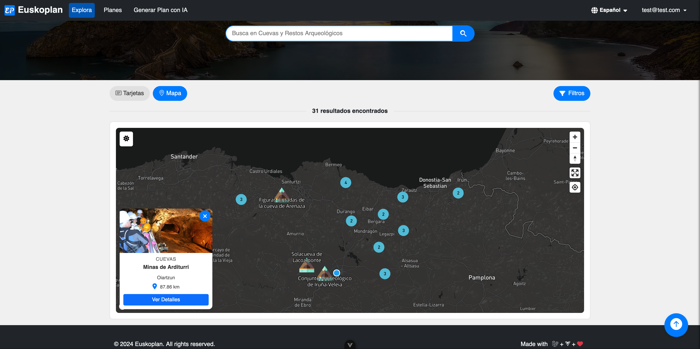

# 🚧 Under Development 🚧

# Euskoplan Client

Discover the beauty of the Basque Country with Euskoplan, an interactive web platform designed for tourism enthusiasts. Create personalized itineraries, explore popular destinations, and share your travel plans with other users.

## Table of Contents

- [Getting Started](#getting-started)
- [Installation](#installation)
- [Environment Setup](#environment-setup)
- [Running the Project](#running-the-project)
- [Backend API](#backend-api)
- [License](#license)
- [Screenshots](#screenshots)

## Getting Started

These instructions will help you set up the Euskoplan project on your local machine for development and testing purposes.

## Installation

1. **Clone the Repository**

   Clone this repository to your local machine using the following command:

   ```bash
   git clone https://github.com/asier-ortiz/euskoplan-client.git
   cd euskoplan-client
   ```

2. **Install Dependencies**

   Install the required dependencies by running:

   ```bash
   npm install
   ```

## Environment Setup

Before running the project, you need to configure the environment variables.

1. **Copy the `.env` file**

    - On **Linux or macOS**:

      ```bash
      cp .env.example .env
      ```

    - On **Windows**:

      ```bash
      copy .env.example .env
      ```

2. **Add your API keys**

   Open the `.env` file you just created and add your Mapbox API key:

   ```plaintext
   VITE_MAPBOX_API_KEY=your_mapbox_api_key_here
   ```

## Running the Project

To start the development server, run:

```bash
npm run dev
```

The application will be available at `http://localhost:4200` by default.

## Backend API

Euskoplan relies on a Laravel-based backend API to function properly. Please follow the instructions in the [Euskoplan API repository](https://github.com/asier-ortiz/euskoplan-api) to set up and run the backend on your local machine.

Ensure that the backend API is running before attempting to use the Euskoplan frontend.

## License

This project is licensed under the MIT License - see the [LICENSE](LICENSE) file for details.

## Screenshots





